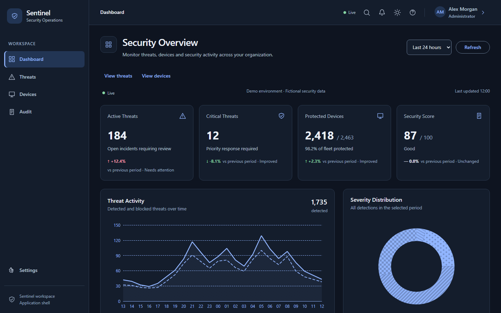
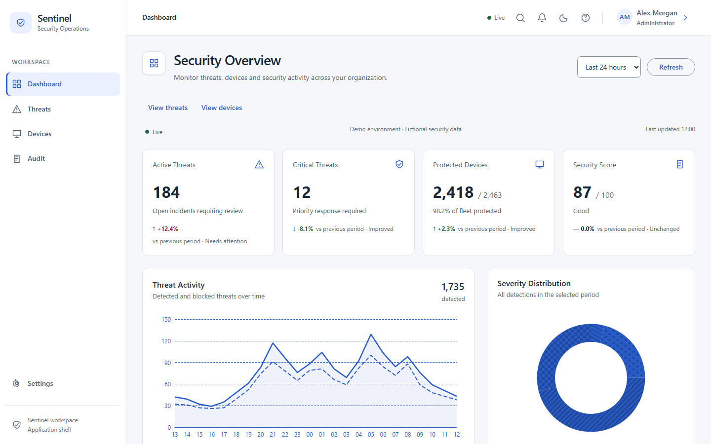
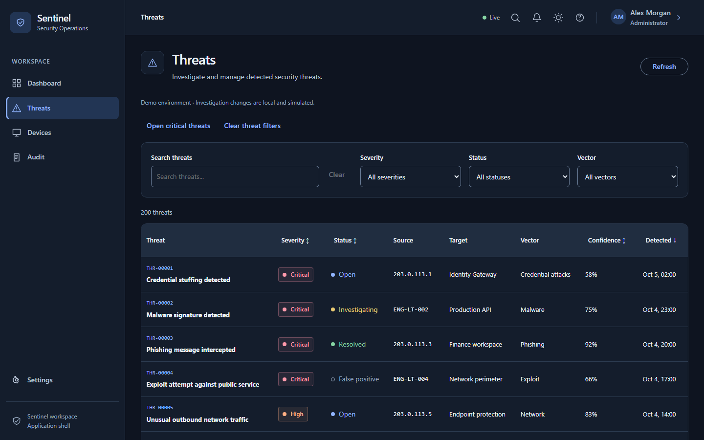
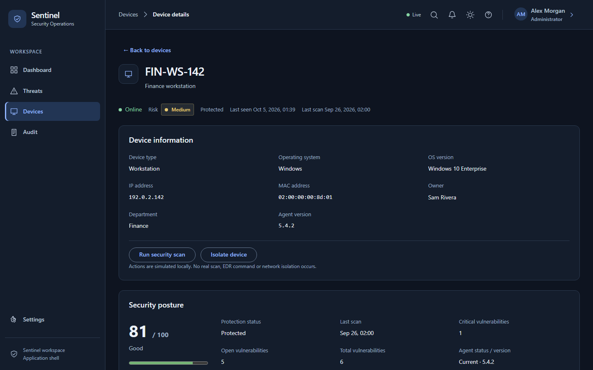
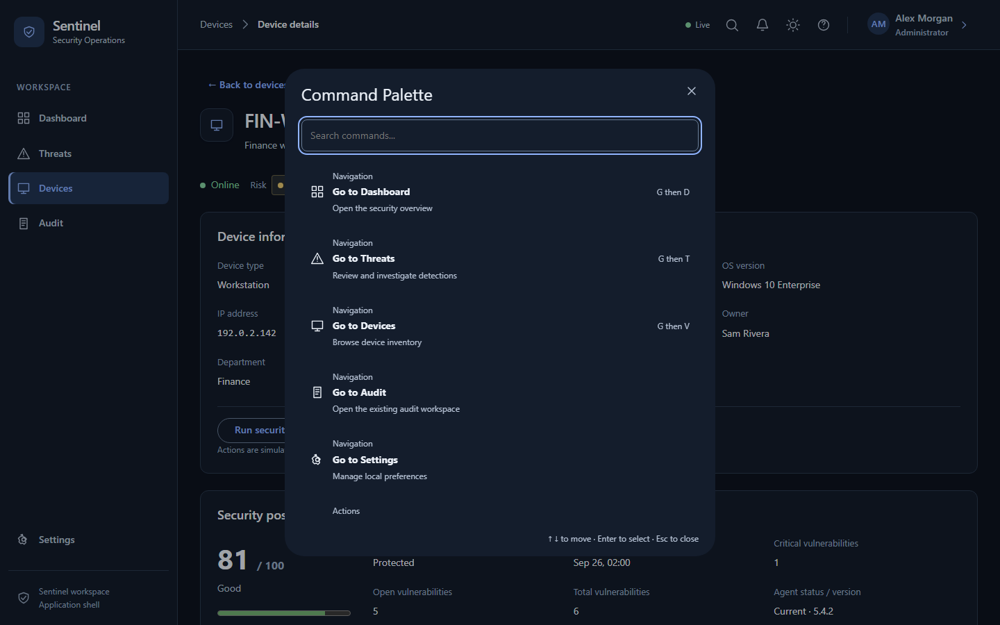

# Sentinel

Cybersecurity Operations Dashboard built with Angular.

Sentinel simulates a modern Security Operations Center where analysts can monitor threats, investigate incidents, inspect device security posture and react to realtime security events.

  



## Live Demo

Deployment configuration is included. Publish URL pending.

Use the [Vercel or Docker deployment guide](docs/deployment.md). Remote CI/deployment status is not claimed.

## Demo accounts

| Role    | Email                | Password     |
| ------- | -------------------- | ------------ |
| Admin   | admin@sentinel.dev   | Sentinel123! |
| Analyst | analyst@sentinel.dev | Sentinel123! |
| Viewer  | viewer@sentinel.dev  | Sentinel123! |

These accounts are mock demo credentials. The login page can fill them automatically. Admin manages devices and Settings; Analyst investigates threats; Viewer has read-only access.

## Features

- SOC Dashboard with KPIs, date ranges and deferred charts.
- Threat Management with investigation details and local status actions.
- Device Inventory with security posture, mock scans and isolation.
- Simulated realtime events with reconnect, validation and deduplication.
- Role-based routing, navigation and actions (RBAC).
- Notification Center, Command Palette and keyboard shortcuts.
- User Preferences, light/dark theme and reduced motion.

Audit remains a preview. All data and security actions are fictional.

## Screenshots






Eight real production screenshots at 1440×900 are available in [docs/screenshots](docs/screenshots). Reproduce them with `npm run build` followed by `npm run release:capture` after installing Chromium.

## Tech stack

Angular 22 · TypeScript 6 · Signals · RxJS · Angular Material/CDK · ECharts (modular SVG) · SCSS · Vitest · Playwright · axe · GitHub Actions · Docker/nginx.

## Architecture

Feature-first architecture with standalone, zoneless Angular and lazy routes. Signals hold application state; RxJS composes asynchronous operations and event streams. Repository abstractions separate data access from feature stores. A typed realtime transport boundary supports validation, bounded deduplication, ordering and reconnect behavior. An explicit RBAC permission model governs guards, commands and UI actions.

See the [architecture and Mermaid diagram](docs/architecture.md), [technical decisions](docs/decisions.md) and [portfolio case study](docs/case-study.md).

```text
.github/workflows/   CI: quality, E2E and Docker
docs/               Architecture, decisions, results, screenshots, case study
e2e/                Browser fixtures, helpers and critical-flow specs
public/             Local static assets and early theme initialization
scripts/            Test runner, bundle gate, production preview and audits
src/app/core/       Auth, permissions, realtime, commands, preferences
src/app/features/   Domain pages, stores, models and repositories
src/app/layout/     Shell, header and navigation
src/app/shared/     Reusable UI, directives and utilities
src/styles/         Semantic tokens, themes and shared SCSS
```

## Quality metrics

Final local release validation: **383 unit/integration tests**, **47 E2E tests**. Coverage includes application UI and business logic; gates are 80% lines/statements, 75% functions and 70% branches. Pure configuration, specs and deterministic fixtures are excluded.

| Metric     | Release run |
| ---------- | ----------- |
| Lines      | 89.06%      |
| Statements | 86.05%      |
| Functions  | 86.79%      |
| Branches   | 86.76%      |

The Sprint 9 reference was 89.11% / 86.13% / 86.98% / 86.82%, respectively. Release values above reflect the actual rerun, not copied targets. [Validation details](docs/release-validation.md) record checks and limits.

## Performance

| Local laboratory measurement     | Before    | After              |
| -------------------------------- | --------- | ------------------ |
| Initial bundle (raw, decimal kB) | 497.63 kB | 355.71 kB (−28.5%) |
| Dashboard LCP                    | 889 ms    | 681 ms (−23.4%)    |

Sprint 9 desktop Lighthouse medians: Login and authenticated Dashboard score **100 Performance / 100 Accessibility / 100 Best Practices** after optimization. These are **local laboratory measurements**, not real-user data, production monitoring or mobile guarantees. The final build confirms the 355.71 kB initial bundle.

The [performance protocol and results](docs/performance.md) include the [raw measurement record](docs/performance-results.json). `@defer (on viewport)` keeps the ECharts engine out of the initial bundle; deferred charts still have a cost. Production budgets and `scripts/check-bundles.mjs` guard against bundle regressions and testing code leakage.

## Accessibility

Designed and tested against WCAG 2.2 AA criteria.

Keyboard navigation, skip link, route/overlay focus management, reduced motion, actual 200/400% Chromium zoom and axe automated testing cover critical screens and interactions. Status labels and visual patterns complement color. [Review scope](docs/performance.md#accesibilidad-y-alcance-de-la-revisión) records the limits: automated checks and keyboard review do not replace NVDA/VoiceOver user testing.

## Security and demo limits

Authentication is mocked. There is no backend or database. Frontend RBAC does not replace backend authorization. Realtime is simulated; actions change local mock data. Demo tokens use sessionStorage, while theme/preferences use validated localStorage. Do not enter real credentials or sensitive incident data, and do not use Sentinel as a real monitoring product. See [SECURITY.md](SECURITY.md).

## Installation and development

Node **24.21.0** is pinned in `.nvmrc` and shared with CI; npm 11 and the committed lockfile provide reproducible installation.

```bash
npm ci
npm start
```

Open `http://localhost:4200`. On PowerShell with restricted script execution, use `npm.cmd` without changing system policy.

## Validation

```bash
npm run quality
npm run test:coverage
npx playwright install chromium
npm run e2e
npm run build
npm run preview:production
```

`quality` runs format check, lint, app/E2E typecheck, unit/integration and production build. Coverage and E2E run separately. Build outputs `dist/sentinel/browser`; the preview serves it on `http://127.0.0.1:4400` with SPA fallback. `npm test -- --run` also runs the Angular/Vitest suite once. On Linux use `npx playwright install --with-deps chromium` for browser setup.

E2E starts its own server on port 4300 using a separate deterministic testing entry. Production never includes that event bridge. `npm run release:capture` uses the actual production build and tests login, dashboard and deep-route reloads while producing screenshots.

## Docker

```bash
docker build -t sentinel .
docker run --rm -p 8080:80 sentinel
```

Multi-stage Node build → nginx Alpine static runtime. nginx supports SPA refresh, missing-asset 404, gzip, immutable hashed bundles, revalidated HTML and static security headers. Docker was not available locally; the [deployment guide](docs/deployment.md) and CI job provide container validation steps. No image size or local Docker PASS is claimed.

## GitHub Actions and release

CI installs with `npm ci`, checks formatting/lint/types, runs unit/integration, coverage, build, Playwright and Docker smoke. Coverage and browser failure diagnostics are retained for seven days. Vercel's Git integration manages deployment after connection; no deploy secrets are required by CI.

Version **1.0.0** is prepared; see [CHANGELOG](CHANGELOG.md), [release validation](docs/release-validation.md) and [repository metadata recommendations](docs/repository-metadata.md). No release tag or remote publication has been performed. Licensed under [MIT](LICENSE).
