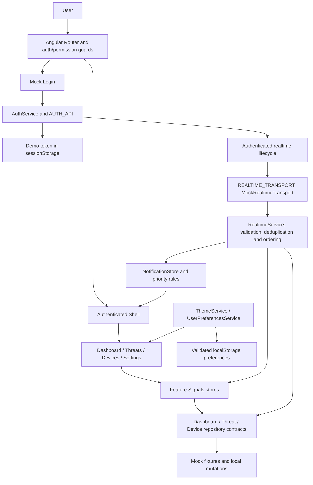

# Architecture

## Application architecture

Sentinel is a client-only Angular 22 application with standalone components and zoneless change detection. `app.routes.ts` lazily loads Login, the authenticated Shell and domain routes. `core/` holds infrastructure, `features/` holds domain UI, models and data access, `layout/` composes navigation, and `shared/` contains reusable UI. Audit remains a preview; Settings edits local preferences.

## State management

Signals hold application state; computed values derive permissions, counts, filtered UI state and preferences. Feature list/detail stores manage loading, errors and mutation concurrency. RxJS handles asynchronous repository responses and event streams. Threat/Device query parsing normalizes URL filters, sort and pagination; reload and Back restore the same query. URL state takes precedence over the default page size preference.

## Data access

Repository contracts separate pages/stores from mock data and local mutations. Providers select concrete adapters. Data is fictional; successful mock actions do not imply durable persistence. A future API adapter must preserve typed results, error handling and concurrency semantics. `API_BASE_PATH` is relative (`/api`); the auth interceptor only attaches the demo token within that same-origin path boundary. No API server currently exists.

## Authentication/RBAC

`AuthService` restores the mock session before guards evaluate it and protects against obsolete login/restore operations. The token is stored in sessionStorage; roles map to explicit permissions. Router guards, navigation, commands and mutation controls apply this model. Admin manages devices/settings; Analyst investigates threats; Viewer reads data. These client checks are not a security boundary: a real service must authenticate and authorize every operation server-side.

## Realtime

`REALTIME_TRANSPORT` supplies an adapter with long-lived event and connection-state Observables. `MockRealtimeTransport` simulates events and drops. `RealtimeService` validates unknown payloads, bounds deduplication memory, applies ordering rules and manages reconnect backoff. App lifecycle binds connection to authentication. Stores/repositories project validated events; threat lists batch refreshes while preserving query state. Notification rules create selected priority entries, and critical feedback is rate limited. History is bounded and reset with the session. The mock has no durable replay; a real WebSocket adapter is future work.

## Testing

Vitest through Angular's official builder checks rules, stores, services, routing and integrations. Playwright exercises critical flows, roles, browser preferences, keyboard navigation, axe and actual Chromium zoom. Its separate entry point reduces mock delays and exposes a deterministic event bridge; it is excluded from production. `scripts/check-bundles.mjs` rejects testing inputs or the chart engine in the initial bundle. `scripts/capture-release.mjs` uses the production entry and actual demo login for screenshots and deep-route reload smoke.

## Performance

Feature routes and UX dialogs are lazy. `@defer (on viewport)` loads modular SVG ECharts while reserved chart space limits layout shift. Chart instances survive dataset updates and are disposed with their views. Lists are paginated and tracked by ID; history and notification retention are bounded. Production has explicit source maps off, content hashes, budgets and a bundle gate. [Performance results](performance.md) describe laboratory measurements and their limits. [Deployment](deployment.md) describes SPA serving and cache behavior.
